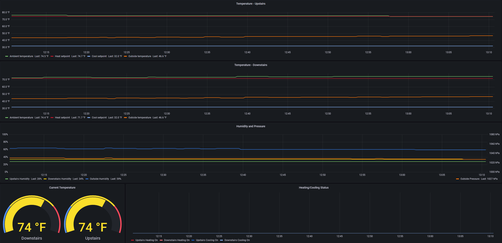

# ProNestheus


[](https://goreportcard.com/report/github.com/vvarga007/pronestheus)

Forked project form https://github.com/grdl/pronestheus

A Prometheus exporter for the [Nest Learning Thermostat](https://nest.com/). Exposes metrics about your thermostats and the weather in your current location.

Works with the new [Google Smart Device Management API](https://developers.google.com/nest/device-access)!



## Installation

### Binary download

Grab the Linux, macOS or Windows executable from the [latest release](https://github.com/vvarga007/pronestheus/releases/latest).

### Docker image

```
docker run -p 9777:9777 -e "PRONESTHEUS_NEST_TOKEN=xxx" vavhab/pronestheus
```

### Helm chart

Helm chart is available in `deployments/helm`.

### "One-click" installation with Docker Compose

Update necessary variables in `deployments/docker-compose/.env` file. Then run:
```
cd deployments/docker-compose
docker-compose up
```

This will start docker containers with Prometheus, Grafana and ProNestheus exporter automatically configured. Visit http://localhost:3000 to open Grafana dashboard with your thermostat metrics.


### Usage and configuration

All configuration flags can be passed as environment variables with `PRONESTHEUS_` prefix. Eg, `PRONESTHEUS_NEST_AUTH`.

```
usage: pronestheus [<flags>]

Flags:
  -h, --help                     Show context-sensitive help (also try --help-long and --help-man).
      --listen-addr=":9777"      Address on which to expose metrics and web interface.
      --metrics-path="/metrics"  Path under which to expose metrics.
      --scrape-timeout=5000      Time to wait for remote APIs to response, in milliseconds.
      --nest-url="https://smartdevicemanagement.googleapis.com/v1/"  
                                 Nest API URL.
      --nest-client-id=NEST-CLIENT-ID  
                                 OAuth2 Client ID
      --nest-client-secret=NEST-CLIENT-SECRET  
                                 OAuth2 Client Secret.
      --nest-project-id=NEST-PROJECT-ID  
                                 Device Access Project ID.
      --nest-refresh-token=NEST-REFRESH-TOKEN  
                                 Refresh token
      --owm-url="http://api.openweathermap.org/data/2.5/weather"  
                                 The OpenWeatherMap API URL.
      --owm-auth=OWM-AUTH        The authorization token for OpenWeatherMap API.
      --owm-location="2759794"   The location ID for OpenWeatherMap API. Defaults to Amsterdam.
  -v, --version                  Show application version.

```


### Authentication

To be able to call the Nest API you need to register for Device Access with Google (there's a one-time $5 fee) and follow [the Get Started guide](https://developers.google.com/nest/device-access/get-started) to create a Device Access project and OAuth2 client.

Then, follow the [Authorize the account guide](https://developers.google.com/nest/device-access/authorize) to get the necessary values for:
* OAuth2 Client ID
* OAuth2 Client Secret
* Device Access Project ID
* OAuth2 Refresh Token

Because ProNestheus is meant to run continuously, it doesn't require OAuth2 Access Token, only the Refresh Token. It will automatically get the valid access token and refresh it when needed.


OpenWeatherMap API key is required to call the weather API. [Look here](https://openweathermap.org/appid) for instructions on how to get it.


## Exported metrics

```
# HELP nest_ambient_temperature_celsius Inside temperature.
# TYPE nest_ambient_temperature_celsius gauge
nest_ambient_temperature_celsius{id="enterprises/not-a-valid-id-aaj232sxs-ce34ad-33-sd",label="Downstairs"} 23.579987
nest_ambient_temperature_celsius{id="enterprises/not-a-valid-id-bgj232scs-ce345d-36-sd",label="Upstairs"} 23.589996
# HELP nest_cool_setpoint_temperature_celsius Cool setpoint temperature.
# TYPE nest_cool_setpoint_temperature_celsius gauge
nest_cool_setpoint_temperature_celsius{id="enterprises/not-a-valid-id-aaj232sxs-ce34ad-33-sd",label="Downstairs"} 0
nest_cool_setpoint_temperature_celsius{id="enterprises/not-a-valid-id-bgj232scs-ce345d-36-sd",label="Upstairs"} 0
# HELP nest_cooling Is thermostat cooling.
# TYPE nest_cooling gauge
nest_cooling{id="enterprises/not-a-valid-id-aaj232sxs-ce34ad-33-sd",label="Downstairs"} 0
nest_cooling{id="enterprises/not-a-valid-id-bgj232scs-ce345d-36-sd",label="Upstairs"} 0
# HELP nest_heat_setpoint_temperature_celsius Heat setpoint temperature.
# TYPE nest_heat_setpoint_temperature_celsius gauge
nest_heat_setpoint_temperature_celsius{id="enterprises/not-a-valid-id-aaj232sxs-ce34ad-33-sd",label="Downstairs"} 22.058258
nest_heat_setpoint_temperature_celsius{id="enterprises/not-a-valid-id-bgj232scs-ce345d-36-sd",label="Upstairs"} 23.744415
# HELP nest_heating Is thermostat heating.
# TYPE nest_heating gauge
nest_heating{id="enterprises/not-a-valid-id-aaj232sxs-ce34ad-33-sd",label="Downstairs"} 0
nest_heating{id="enterprises/not-a-valid-id-bgj232scs-ce345d-36-sd",label="Upstairs"} 0
# HELP nest_humidity_percent Inside humidity.
# TYPE nest_humidity_percent gauge
nest_humidity_percent{id="enterprises/not-a-valid-id-aaj232sxs-ce34ad-33-sd",label="Downstairs"} 34
nest_humidity_percent{id="enterprises/not-a-valid-id-bgj232scs-ce345d-36-sd",label="Upstairs"} 28
# HELP nest_up Was talking to Nest API successful.
# TYPE nest_up gauge
nest_up 1
# HELP nest_weather_humidity_percent Outside humidity.
# TYPE nest_weather_humidity_percent gauge
nest_weather_humidity_percent 59
# HELP nest_weather_pressure_hectopascal Outside pressure.
# TYPE nest_weather_pressure_hectopascal gauge
nest_weather_pressure_hectopascal 1027
# HELP nest_weather_temperature_celsius Outside temperature.
# TYPE nest_weather_temperature_celsius gauge
nest_weather_temperature_celsius 8.11
# HELP nest_weather_up Was talking to OpenWeatherMap API successful.
# TYPE nest_weather_up gauge
nest_weather_up 1
```
